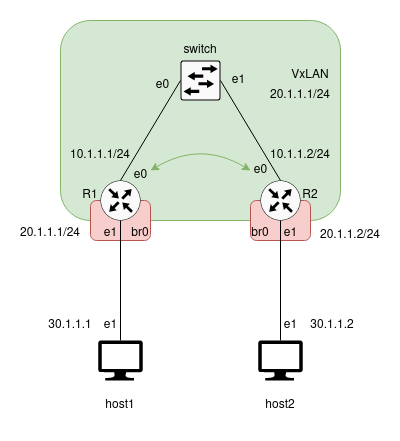

# P2

We want to create a VxLAN to encapsulate the incoming traffic from the Hosts at layer 2 in UDP packets with a VxLAN header containing the VxLAN identifier (VNI).  
These packets are then decapsulated at the other end of VxLAN (Header removed) and the content is delivery to the specified IP Address.     

The routing schema is as follows



## Configurations

Name               | Interface | IP Address | Mask
-------------------|-----------|------------|-------------------
host_mdesoeuv-1    | eth1      | 30.1.1.1   | 24 (255.255.255.0)
host_mdesoeuv-2    | eth1      | 30.1.1.2   | 24
routeur_mdesoeuv-1 | eth0      | 10.1.1.1   | 24
routeur_mdesoeuv-1 | eth1      | bridged    | /       
routeur_mdesoeuv-1 | vxlan10   | 20.1.1.1   | 24
routeur_mdesoeuv-2 | eth0      | 10.1.1.2   | 24
routeur_mdesoeuv-2 | eth1      | bridged    | /      
routeur_mdesoeuv-2 | vxlan10   | 20.1.1.2   | 24


### Routers

1. Create Bridge Domain
```
ip link add br0 type bridge
ip link set dev br0 up

```

2. Set eth0 ip address  

`ip addr add 10.1.1.1/24 dev eth0`

3. Create VxLAN

Creation of a VxLAN with id 10  
The eth0 interface of the local router is linked to the eth0 interface (referred as `local`) of the second router (referred as `remote`)  


- Unicast  

Unicast is a one-to-one delivery mode

```
ip link add name vxlan10 type vxlan id 10 dev eth0 remote 10.1.1.2 local 10.1.1.1 dstport 4789
```

- Multicast

Multicast is a one-to-many delivery mode and is more efficient when packets must be delevered to multiple destinations at once

```
ip link add name vxlan10 type vxlan id 10 dev eth0 group 239.1.1.1 dstport 4789
```

- Add ip address to VxLAN

```
ip addr add 20.1.1.1/24 dev vxlan10 
```

- Activate VxLAN

```
ip link set dev vxlan10 up
```

4. Add eth1 to Brigde Domain

```
brctl addif br0 eth1
```

5. Add vxlan10 to Bridge Domain

```
brctl addif br0 vxlan10
```


### Hosts
For each host, follow these steps:

1. Setup eth1 IP : 
```
$ ip addr add <ip_address>/<mask> dev eth1
```


### Checks

#### On the Host console

`ping <host_ip>`


#### On the Router console

- Show vxlan configuration
`/sbin/ip -d link show vxlan10`  

- Show mac addresses in bridge domain
`/usr/sbin/brctl showmacs br0`

