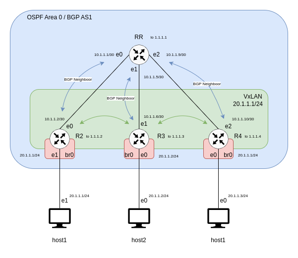

# P3

## Goal

We want host 1, host 2 and host 3 to communicate together as if they were on the same network (On the same LAN) even if they are not.  
This time we want to setup a network in which every router knows all the mac adresses of the devices connected to it. This can be done by using `BGP EVPN`.  
In addition we will keep our VXLAN configuration as explained in P2 to able the hosts to communicate with each other.

## How EVPN is used to share mac addresses connected to the network ?

Please go to the root Readme to have the definition of spine/leaf routers.

In an EVPN (Ethernet VPN) environment, particularly in a spine-leaf architecture, the discovery and sharing of MAC addresses work through a coordinated effort between the leaf and spine routers. Here's how it generally works:

1. **MAC Address Discovery at Leaf Routers**:
    - When a new device connects to the network, it is typically connected to a leaf router (or switch).
    - The leaf router learns the MAC address of the new device through traditional Layer 2 learning methods. When a device sends a frame, the source MAC address of that frame is learned and stored in the MAC address table of the leaf router.

2. **Propagation of MAC Address Information**:
    - Once the leaf router learns a new MAC address, it uses EVPN to propagate this information to other routers in the network, including spine routers.
    - EVPN employs BGP (Border Gateway Protocol) as its control plane to distribute MAC address reachability information. This means that when a leaf router learns a new MAC address, it advertises this information to its BGP peers, which include the spine routers in the network.

3. **Learning MAC Addresses at Spine Routers**:
    - Spine routers receive these advertisements and update their own BGP tables with the MAC address information, along with associated metadata like the VNI (VXLAN Network Identifier) and the IP address of the advertising leaf router.
    - While spine routers learn about the existence and reachability of these MAC addresses, they typically do not directly forward client traffic. Their primary role is to facilitate the proper routing of traffic between leaf routers.

4. **Synchronization Among Leaf Routers**:
    - Other leaf routers in the network also receive these BGP advertisements. This allows all leaf routers to have synchronized knowledge about the MAC addresses in the network, even if they did not directly learn them from connected devices.
    - This synchronization ensures that any leaf router can forward traffic to any MAC address in the network, as it knows which leaf router is connected to that particular MAC address.

In summary, both leaf and spine routers participate in learning and distributing MAC address information in an EVPN network. Leaf routers learn MAC addresses directly from connected devices and advertise this information via EVPN/BGP. Spine routers, along with other leaf routers, receive these advertisements, ensuring network-wide knowledge of MAC address reachability. This coordination is crucial for efficient routing and forwarding of traffic within the spine-leaf architecture.

The routing schema is as follows



## Configurations

Name               | Interface | IP Address | Mask
-------------------|-----------|------------|-------------------
host_mdesoeuv-1    | eth1      | 30.1.1.1   | 24 (255.255.255.0)
host_mdesoeuv-2    | eth1      | 30.1.1.2   | 24
routeur_mdesoeuv-1 | eth0      | 10.1.1.1   | 24
routeur_mdesoeuv-1 | eth1      | bridged    | /       
routeur_mdesoeuv-1 | vxlan10   | 20.1.1.1   | 24
routeur_mdesoeuv-2 | eth0      | 10.1.1.2   | 24
routeur_mdesoeuv-2 | eth1      | bridged    | /      
routeur_mdesoeuv-2 | vxlan10   | 20.1.1.2   | 24


### Routers

Routers must be configurated first, all commands are included in a script named `router1.sh` and `router2.sh` in the root directory  
Each router must be setup with the command `bash router<router_number>.sh`  

1. Create Bridge Domain
```
ip link add br0 type bridge
ip link set dev br0 up

```

2. Set eth0 ip address  

`ip addr add 10.1.1.1/24 dev eth0`

3. Create VxLAN

Creation of a VxLAN with id 10  
The eth0 interface of the local router is linked to the eth0 interface (referred as `local`) of the second router (referred as `remote`)  


- Unicast  

Unicast is a one-to-one delivery mode

```
ip link add name vxlan10 type vxlan id 10 dev eth0 remote 10.1.1.2 local 10.1.1.1 dstport 4789
```

- Multicast

Multicast is a one-to-many delivery mode and is more efficient when packets must be delevered to multiple destinations at once

```
ip link add name vxlan10 type vxlan id 10 dev eth0 group 239.1.1.1 dstport 4789
```

- Add ip address to VxLAN

```
ip addr add 20.1.1.1/24 dev vxlan10 
```

- Activate VxLAN

```
ip link set dev vxlan10 up
```

4. Add eth1 to Brigde Domain

```
brctl addif br0 eth1
```

5. Add vxlan10 to Bridge Domain

```
brctl addif br0 vxlan10
```


### Hosts

For each host, the IP address of eth1 must be set  
A script is provided in the root directory and is executed with the command `sh host<host_number>.sh`  


1. Setup eth1 IP : 
```
$ ip addr add <ip_address>/<mask> dev eth1
```


### Checks

#### On the Host console

`ping <host_ip>`


#### On the Router console

- Show vxlan configuration
`/sbin/ip -d link show vxlan10`  

- Show mac addresses in bridge domain
`/usr/sbin/brctl showmacs br0`

